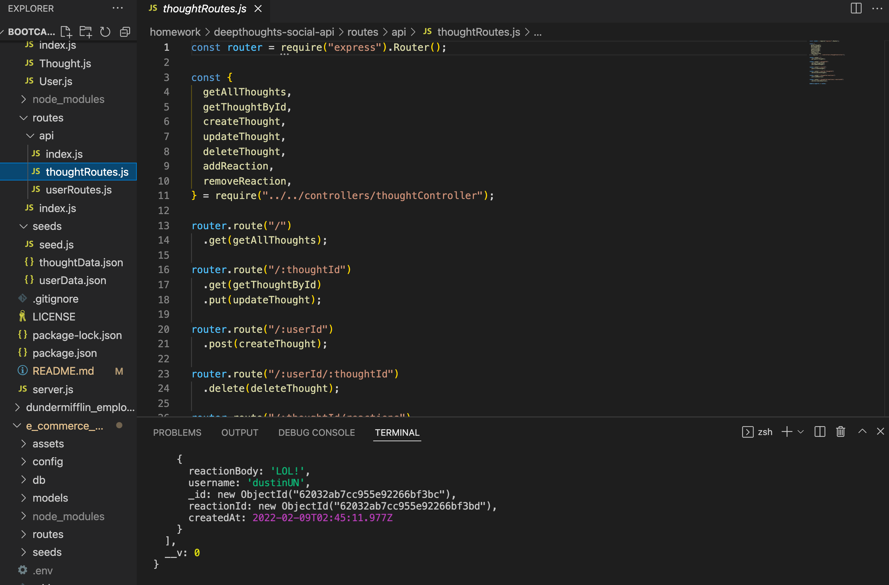

# Deep Thoughts: A Social Network API

## Description

Deep Thoughts is a custom API for a social network web application. Users can share their thoughts, react to friends’ thoughts, and create a friend list. This was built using Express.js for routing, a MongoDB database, and the Mongoose ODM. Routes were tested in Insomnia.

## Table of Contents

- [Installation](#installation)
- [Usage](#usage)
- [User Story](#userstory)
- [Credits](#credits)
- [License](#license)
- [Questions](#questions)

## Installation

This api can be tested locally using Insomnia by cloning the repo and adding your own seed data.

## User Story

```md
AS A social media startup
I WANT an API for my social network that uses a NoSQL database
SO THAT my website can handle large amounts of unstructured data
```

## Usage



A video walk through of the Insomnia testing is below:

[Video Walkthrough](https://drive.google.com/file/d/1bxjjC2JcQku-lga2XpnhjWuaMmtC1244/view?usp=sharing)

## Credits

Coding was completed by Lauren Ferrett, using references from class activities.

## License

MIT License

Copyright (c) 2022 Lauren Ferrett

Permission is hereby granted, free of charge, to any person obtaining a copy
of this software and associated documentation files (the "Software"), to deal
in the Software without restriction, including without limitation the rights
to use, copy, modify, merge, publish, distribute, sublicense, and/or sell
copies of the Software, and to permit persons to whom the Software is
furnished to do so, subject to the following conditions:

The above copyright notice and this permission notice shall be included in all
copies or substantial portions of the Software.

THE SOFTWARE IS PROVIDED "AS IS", WITHOUT WARRANTY OF ANY KIND, EXPRESS OR
IMPLIED, INCLUDING BUT NOT LIMITED TO THE WARRANTIES OF MERCHANTABILITY,
FITNESS FOR A PARTICULAR PURPOSE AND NONINFRINGEMENT. IN NO EVENT SHALL THE
AUTHORS OR COPYRIGHT HOLDERS BE LIABLE FOR ANY CLAIM, DAMAGES OR OTHER
LIABILITY, WHETHER IN AN ACTION OF CONTRACT, TORT OR OTHERWISE, ARISING FROM,
OUT OF OR IN CONNECTION WITH THE SOFTWARE OR THE USE OR OTHER DEALINGS IN THE
SOFTWARE.

## Questions
Any questions can be directed to lferrett@gmail.com
